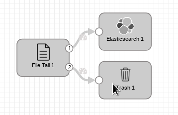
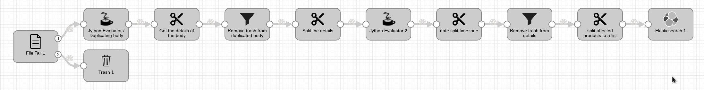

# SDC & ELK Files for Opensuse Mail

This project contains the pipelines used in SDC and Elastic index mapping for Opensuse Mailing List Data. Created for ease of replication

## SDC Pipelines

There are 2 types of pipeline included in this mail, the first is a simple pipeline which only tail the file and directly feed it to elasticsearch, the second one is doing a little bit of data transformation to create new fields

Heres what is looks like :

- Pipeline 1 [opensuse-bugs and opensuse-announce]

    

  This pipeline has not much going in it since the format of the mails in `opensuse-bugs` and `opensuse-announce` is more various and has no "structure" to it. If there is suggestion for improvements please do open an Issue and have a conversation there.

- Pipeline 2 [opensuse-updates and opensuse-security-announce]

    

  This pipeline will generate and/or transform some fields before feeding it to elasticsearch, because it will be useful to do some aggregations on these new fields. These fields includes :

  - `cross_reference` - CVEs and such
  - `affected_product_list` - The list of affected products that is announced
  - `timestamp` - Had to format the raw data in some way so elasticsearch can properly parse it as a Date Type
  - `announcement_id` - This field will be used as an `_id` field for the document

## Getting Started

Clone this repository to your local system 

```
$ git clone .,,
```

### Prerequisites

- A running ELK Cluster (Elasticsearch 6.x)
- Streamsets Data Collector (3.7.1)
- Scraped mail data in json format like:
    
    ```
    {"subject": "[Bug 1117086] Automatic cleanup of old kernels not working", "origin": "bugzilla_noreply@xxxxxxxxxx", "date": "Sat, 01 Dec 2018 00:47:41 +0000", "src_link": "https://lists.opensuse.org/opensuse-bugs/2018-12/msg00000.html", "reference_link": ["http://bugzilla.opensuse.org/show_bug.cgi?id=1117086", "http://bugzilla.opensuse.org/show_bug.cgi?id=1117086#c3"], "msg_body": "\n\n\nhttp://bugzilla.opensuse.org/show_bug.cgi?id=1117086\nhttp://bugzilla.opensuse.org/show_bug.cgi?id=1117086#c3\n\nbob wheater <bwheater@xxxxxxx> changed:\n\n           What    |Removed                     |Added\n----------------------------------------------------------------------------\n                 CC|                            |bnc-team-screening@xxxxxxxx\n                   |                            |ovo.novell.com\n   Target Milestone|---                         |Leap 15.0\n              Flags|                            |needinfo?(bnc-team-screenin\n                   |                            |g@xxxxxxxxxxxxxxxxxxxxxx)\n\n--- Comment #3 from bob wheater <bwheater@xxxxxxx> ---\nWhat is the status of this bug report?\n\n-- \nYou are receiving this mail because:\nYou are on the CC list for the bug.\n\n\n\n\n"}
    ```

### Importing Files to The Cluster

## Deployment

Deploying these files to a live system only require Import steps in the SDC and using the Dev Tools from kibana

### Importing pipelines to SDC

- Log in to the Streamsets Data Collector
- From the left menu select `Import Pipeline`
- Choose the appropriate pipeline from the cloned repository
- Modify it as necessary

### Creating the Index in Elastic Stack

This project contains 2 files for Elastic, `elastic-devtools.txt` and `elastic-curl.txt` which can be as easy as copying and pasting using the appropriate tool (Dev-Tools in kibana / cURL)

## Built With

* Streamsets Data Controller
* Elasticsearch 6.x

## Versioning
   
Semantic Versioning

## Known issues
   
* All the known problems, bugs listed here. Add link to issues if any.

## License

This project is licensed under the XYZ License - see the LICENSE.md file for details
